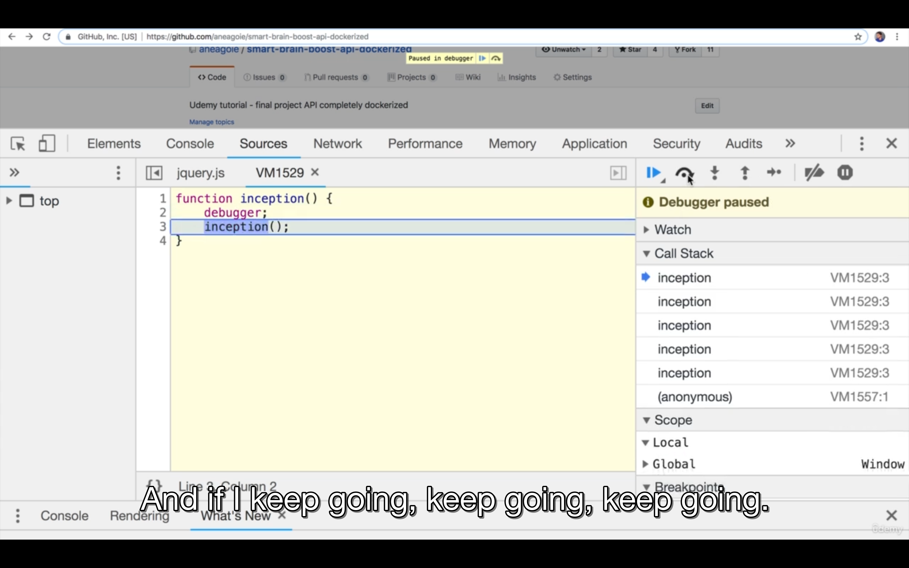

# Section 12: 12 - Algorithms Recursion

## 151-001 Introduction to Algorithms
## 152-002 Recursion Introduction
Recursion isn't technically an algorithm. It's more of a concept, we use it to write algorithms.

For example when we get into sorting and searching through a BST, we're gonna be using recursion.

When you're searching on your files on computer, you want to look at folders recursively, or when we do DOM traversal(tree traversal in general).

Recursion is when you define sth in terms of itself. Recursion is good for tasks that have repeated subtasks to do.

## 153-003 Stack Overflow
If you run this function:
```js
function inception() {
    inception();
}
```
You will get an error that says: `Uncaught RangeError: Maximum call stack size exceede` and eventually, if google chrome console(or other envs) doesn't stop this,
it's gonna crash. This is called stack overflow. 

If you put a `debugger` in the place where the function gets called over and over again, you will see in the call stack of devtools that the function name is
added again to the call stack and never gets removed but will added to the call stack again and again.


One of the biggest problems with recursion is that it can be very dangerous because we can run programs that overflow(never stop).
Also it costs memory. The **call stack** is holding these function calls and one of the downsides of recursion is that we have to hold on to these function
calls and remember them one by one, which can get expensive.

So the computer needs to allocate memory to remember things. Stack overflow can occur when we have recursion and there's no way to stop this recursive call.
So the call stack won't have any memory left and stack overflow would occur.

## 154-004 Anatomy Of Recursion
Every recursive function needs to have sth called a base case or a stop point.

Recursive functions have 2 paths:
1) the recursive case 
2) base case: stop calling the function

Q: What will the console look like after running this?
```js
function inception() {
    inception();
    console.log('hello');
}
inception();
```

A: Nothing will be logged to the console. Because we never reach to the log line because of stack overflow(RangeError: Maximum call stack size exceeded error).

In this example:
```js
let counter = 0;
function inception() {
    if (counter > 3) {
        return 'done';
    }
    
    counter++;
    inception();
}
inception();
```
After calling the function multiple times, we would have multiple inception functions in the call stack and after the counter became 4, the last inception function
call would get removed from callstack and the Return value would be 'done', but after the first call stack pop, the Return value would become undefined. Because
we don't return the result of calling inception. Yeah, in the last call stack value which is the last inception call, we return 'done', but the function calls
before that last one, are only calling inception() without returning the result of calling it. So we need to write: `return inception()` at the last line of function
to actually propagate the result of calling that function recursively.

So there's usually a base case and you always want to make sure you `return`, so that the value you want, gets bubled up all the way to the first call stack value(which
would be a function call definitely, because it's a **call** stack, right? It remembers function calls). 

To build recursive functions:
1) identify the base case(when to stop?)
2) identify the recursive case(when we don't go to the base case)
3) get closer and closer and `return` when needed. Usually you have 2 return keywords(for the base case and recursive case, because you want to return sth at the
end of the function)

So everytime we recurse, the function gets closer and closer to the base case and eventually when it gets to the base case, it finally returns and pops functions off
the stack.

## 155-005 Exercise Factorial

## 156-006 Solution Factorial
We keep going recursively until we hit the base case.

What is the big(o) of this?
```js
function recursiveFactorial(number) {
    // the base case:
    if (number === 2) {
        return 2;
    }
    
    return number * recursiveFactorial(number - 1);
}
```

A: O(n) .

## 157-007 Exercise Fibonacci
## 158-008 Solution Fibonacci
The recursive approach of fibo algo is `O(2^n)` or exponential. 

Exponential time means with every additional element in the fibonacci sequence, we get an increase in function calls, exponentially.

So although the recursive approach for fibo algo might be more readable, it's not an ideal solution since big O time complexity of it is pretty big
and the iterative approach for fibo algo is a lot better with time complexity of `O(n)` .

Fibonacci sequence with recursion can be made to `O(n)` using dynamic programming and memoization.

## 159-009 Recursive VS Iterative
There are times when recursion can keep your code DRY(do not repeat yourself).

recursion cons:

Everytime you add a function to the call stack, it adds extra piece of memory, so you have cases where you can get stack overflows, or if your
system has expensive memory, you want to avoid making too many recursive calls.

The main drawback of recursion is: Iterative approaches tend to be more efficient because they don't make additional function calls that take up the
stack space. But the drawback of iterative approach is that they might be not as readable as recursive ones.

It's good to use recursion when you're working with data structures that you're not sure how deep they are, where you don't know how many loops to go through.

Recursion is useful for things such as tree data structures and doing traversal.

**Tail call optimization** in JS with ES6 allows recursions to be called without increasing the call stack. In other languages as well, with this topic,
there are certain ways to write recursion so they're more memory efficient. So this large stack issue in recursions, can eb resolved during production.
 

## 160-010 When To Use Recursion
When to use recursion?

When it gets to complicated problems like traversing or searching through trees or graphs with BFS and DFS, recursion is really useful and better than
iterative approaches. Also when sorting items, there are also cases that we'll see recursion is preferred.

3 key things in interview that might trigger a recursive solution:
1) A problem can be divided into a number of sub-problems that are smaller instances of that same problem, such as fibonacci or factorial. We can break
the problem down to smaller trees
2) Each of these instances of sub problem is identical in nature, that is the calculations that we need to do, are pretty much the same. They may be smaller
values, but the actual calculations underneath it, is all the same over and over.
3) The solutions for solving the smaller problems(the leaf nodes of that tree), if you combine them, that solves the problem at hand, it's a recursive solutions.

You will see a lot of divide and conquer using recursion. The divide and conquer type of questions, usually have recursion in them and the one thing that
recursions can do that looping can't, is that they can make tasks super easy(in terms of readability), such as these type of problems.

Traversing trees with iterative approach is very harder than recursion. With loops, you usually have to maintain some sort of a stack to keep track of things.


## 151-011 Exercise Reverse String With Recursion
File attached

## 152-012 Recursion Review

---

005 Exercise-Repl
https://repl.it/@aneagoie/Recursion-factorial

006 Solution-Code
https://repl.it/@aneagoie/Recursion-factorial-solution

007 Exercise-Repl
https://repl.it/@aneagoie/Recursion-fibonacci

008 Solution-Code
https://repl.it/@aneagoie/Recursion-fibonacci-solution

009 What-is-Tail-Call-Optimization
http://2ality.com/2015/06/tail-call-optimization.html

010 Tree-Data-Structure-Code
https://repl.it/@aneagoie/Data-Structures-Trees

011 Exercise-Repl
https://repl.it/@aneagoie/reverseString-exercise

011 Solution-Code
https://repl.it/@aneagoie/reverseString

012 Technical-Interview-Mind-Map
https://coggle.it/diagram/W5E5tqYlrXvFJPsq/t/master-the-interview-click-here-for-course-link
